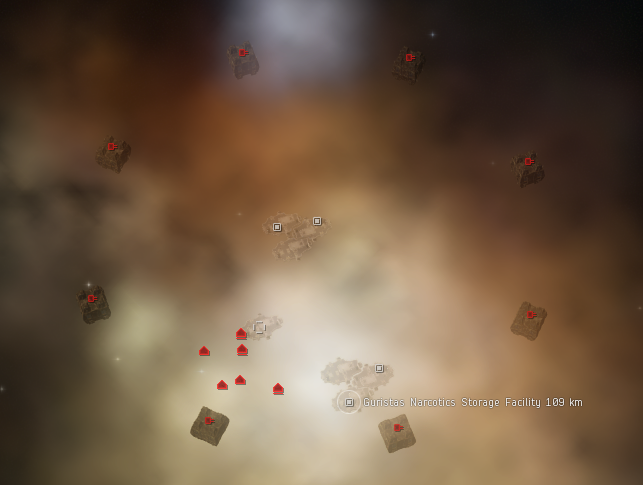
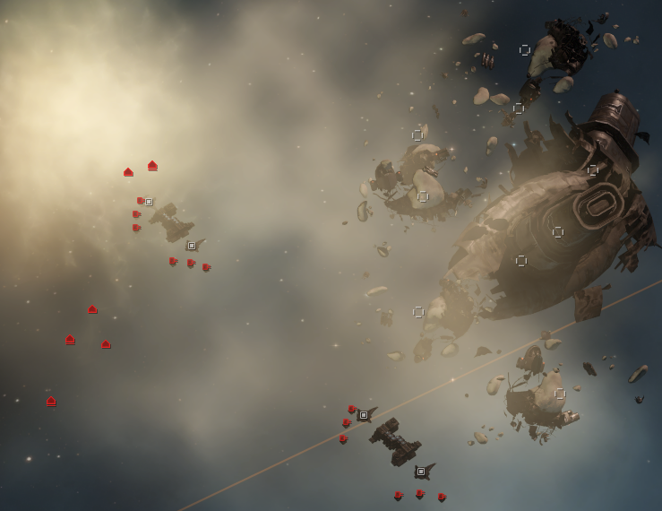
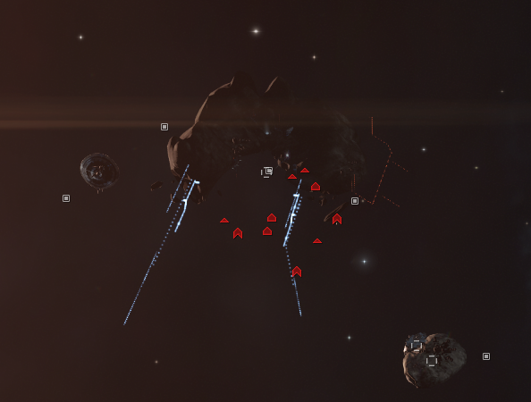
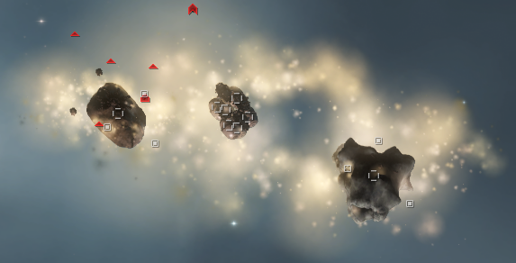
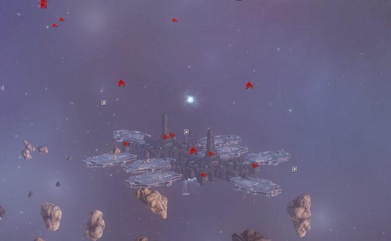
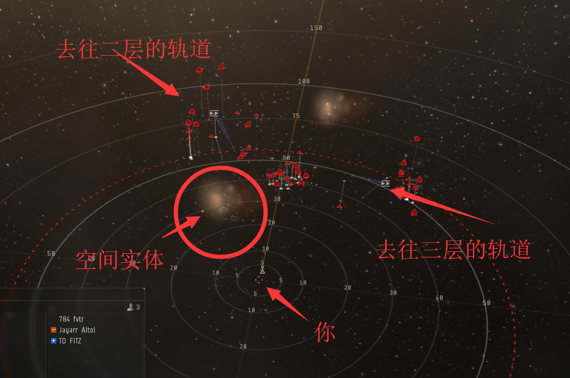
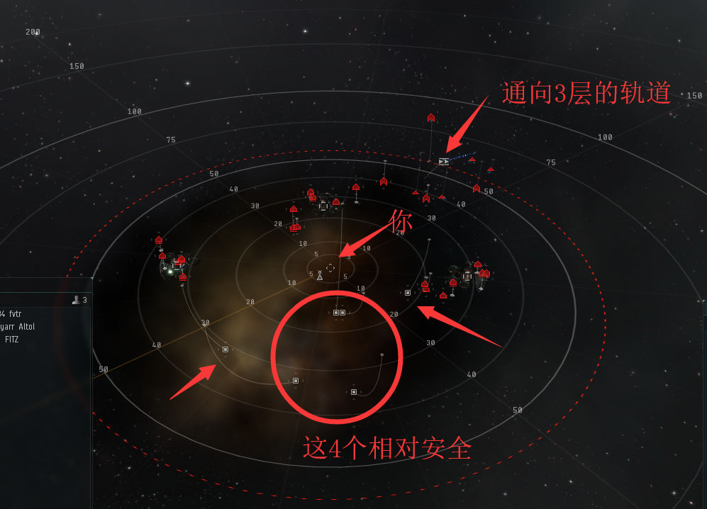
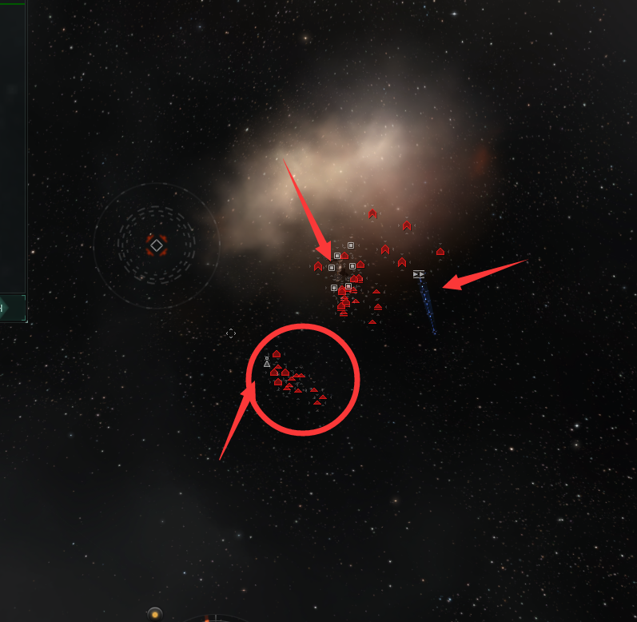

import EveType from "@/components/docs/eve/EveType.tsx";
import EveLocText from "@/components/docs/eve/EveLocText.tsx";
import UrlVideo from "@/components/docs/UrlVideo.astro";

## 站点介绍

部分低安与 00 区域（热点星系大概率出现气云信号，全星域会小概率出现气云信号，之外的其他星域一定找不到气云信号）
会出现增效剂对应的气云采集和战斗站点，一般情况下是应该清怪后再开箱子，
但是因为箱子不上锁，所以可以做到拉怪去开，
主要收益是开出技能书（例如 <EveType typeId={25538} />）和药丸图（例如 <EveType typeId={25307} />）。 
低安的用钢板小白可以不拉怪，直接跳进去开，00 区域必须拉怪。

## 流程

流程视频：

<UrlVideo url="//player.bilibili.com/player.html?aid=31057239&bvid=BV1NW411Z7Cq&page=4" />

1. 跳 0km 点，在显示距离 2000-8000km 的时候，<kbd>Ctrl+B</kbd>保存位置
2. 落地后，扫描，标记值钱的箱子（00 的话，落地马上朝向保存点开推子，再扫描，并把怪拉到离箱子 40km 以上）
3. 跳到刚才保存的点，修满甲，再跳箱子 0m 位置开箱
4. 重复步骤 3，直到开完

## 数据统计

:::tip
III 级气云信号以及战斗气云，被打开过后 1 个小时就会消失，IV 级气云会一直保存 3 天，
在每天 DT 之后站内的箱子会全部刷新，所以就有了养气云的说法：
DT 之前扫一遍后做好位标，DT 之后马上去开。
挖气云的确是新人来钱比较快的途径，但是也比较看脸，很多时候扫了一个星域也没有一本书。
:::

### 低安

#### III 级信号 <EveLocText locId={125831} />

例如：<EveLocText locId={111814} />

出产技能书，脑插，标准图（<EveType typeId={25303} />），普通反应配方（<EveType typeId={46230} />），
小概率加强图（<EveType typeId={25307} />）和加强配方（<EveType typeId={46251} />）。

#### III 级信号 <EveLocText locId={125832} />

例如：<EveLocText locId={111951} />

出产技能书，脑插，标准图，普通反应配方，小概率加强图和加强配方。

#### IV 级信号 <EveLocText locId={111370} />

包含 3-9 个箱子，隐身状态下，部分箱子会隐藏。

:::caution
在这个站点箱子的位置都在角落里面，很容易导致卡建筑损，所以跳 0 点以后先调整自身的位置，然后环绕 500m 观察，
确认不会卡住后再去开箱子。
:::

出产技能书，脑插，标准和加强图，普通和加强反应配方，
小概率超强图（<EveType typeId={25308} />）和超强配方（<EveType typeId={46235} />）。

:::tip
有时会刷两艘货运舰，可能掉落蓝图，可以用货柜扫描一下
:::

### 00 区域

#### IV 级信号 <EveLocText locId={287004} />

:::note
该信号可能为战斗信号（类似野生死亡空间）。
:::

例如：<EveLocText locId={111362} />

包含3-9个箱子，有2座毁电塔（毁电范围 50km），小白一下毁光，还有精英护卫上反跳，所以请务必拉怪挖，
开推子，把怪拉离箱子 50km 即可。
有时会刷出名字唯一的小BOSS（巡洋或战列），可能掉 50-200 流程的蓝图，可以用货柜扫描一下。
有些boss有电子战免疫，会无法被扫描。

#### 战斗气云 III/IV 级信号 "Digital"/"数字" 站点

例如：<EveLocText locId={111883} />

战斗气云包含多个轨道，类似于死亡空间，6/10 难度，<EveType typeId={17715} />可打。能开很多箱子。

## 战斗气云

### 名称及分布地区

| 名称 | 地区 |
| ---- | ---- |
| <EveLocText locId={125602} /> | <EveLocText locId={267688} /> |
| <EveLocText locId={125604} /> | <EveLocText locId={267768} /> |
| <EveLocText locId={125605} /> | <EveLocText locId={267710} /> |
| <EveLocText locId={125606} /> | <EveLocText locId={267798} /> |
| <EveLocText locId={125607} /> | <EveLocText locId={267780} /> |
| <EveLocText locId={125608} /> | <EveLocText locId={267790} /> |
| <EveLocText locId={125609} /> | <EveLocText locId={267694} /> |
| <EveLocText locId={127156} /> | <EveLocText locId={267794} /> |

各地区的战斗气云的结构基本相似，这里以 <EveLocText locId={267768} /> 的 <EveLocText locId={125604} /> 为例，
介绍小白如何挖战斗气云。感谢EVO 3016和784 fvtr 提供的思路和资料。

整体难度 6/10 差不多，毒蜥就可以全清，T3C 能扛怪挖掉。

### 流程

**第一层**

激活轨道后，你在第一层可以看到左右有两个轨道，分别通往第二第三层，第二层出产技能书，第三层出产标准药丸蓝图。
直接开推子冲第二层轨道即可。如果觉得抗不住，可以隐身开推子一轮再慢慢爬过去，注意空间实体，手动控制方向折返一下。

**第二层**

落地后环绕红圈中的箱子，并迅速扫描，除了中间 4 个箱子，左右两边单独标出的箱子，去挖后对应的怪会暴动，
也就差不多低安气云的伤害，注意看本地信息这里可能刷增援，4 个反跳护卫和4 个战巡，
小白可以直接放无人机捏掉反跳护卫，但是会触发暴动，需要跳出去再回来，就只有四个战巡在打你，轻松抗。
那个 3 层轨道基本无视，小白建议从 1 层过去。

如果你是蓝药 <EveType typeId={9950} />，黄药 <EveType typeId={15479} />以及电容药 <EveType typeId={15463} />的区域，
可以去第三层看看，其他药丸区域挖了书层就够了。

**第三层**

落地后边上就是一群怪，需要马上开推子反向拉怪，这层的护卫也有反跳，把大部分的怪拉至远离落地点 30km 以上，
跳出去再回来，开推子靠近箱子，扫描，开箱子。
如果你是上述的 3 种药丸之一，推荐你去第四层，大概率出超强蓝图。
激活第四层的轨道需要把第三层的怪清光，怪物数量和第三层近似，也有反跳护卫。

:::tip
第三层开了箱子 1 小时后信号才消失，DT 之前清掉的怪不会刷新，所以可以养。
:::