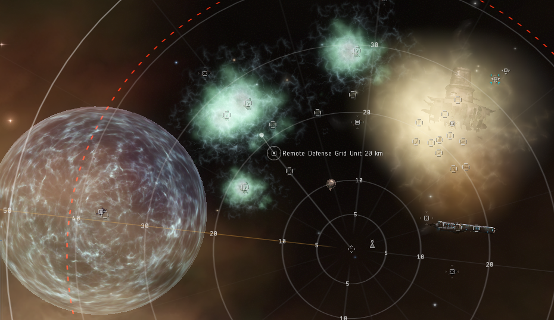

import EveType from "@/components/docs/eve/EveType.tsx";
import EveLocText from "@/components/docs/eve/EveLocText.tsx";
import UrlVideo from "@/components/docs/UrlVideo.astro";

<EveLocText locId={296755} /> 是一个 IV 级数据站点，只限制护卫等级船只进入，收益在 20m 左右， 需要
85+（拢针）的扫描强度，大部分为红色难度核心，整体难度较为简单。

上图为限冬的整体俯视图，绿的和黄的云是有伤害的，对无抗性的船是 100 DPS。左下的球状立场会阻止你靠近箱子。

| 名称                       | 注解                                                                                            | 成功                    | 失败                                        |
| -------------------------- | ----------------------------------------------------------------------------------------------- | ----------------------- | ------------------------------------------- |
| <EveType typeId={34305} /> | 远处                                                                                            | 关闭球状立场            | 1.什么都没有发生 2.爆炸，造成 1225 伤害 |
| <EveType typeId={34301} /> | 身边那个                                                                                        | 关闭黄云的伤害 2-3 分钟 | 造成 200 伤害                               |
| <EveType typeId={34302} /> | 外观是一个罐子， 高速靠近 (>100m/s) 7-10km 可能会爆炸， 造成 500 伤害，生成一片新的毒云 |                         |                                             |

流程视频：

<UrlVideo url="//player.bilibili.com/player.html?aid=31057239&bvid=BV1NW411Z7Cq&page=1" />
