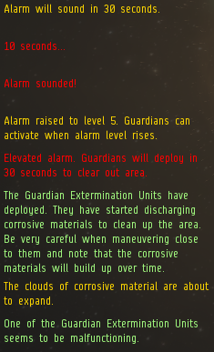
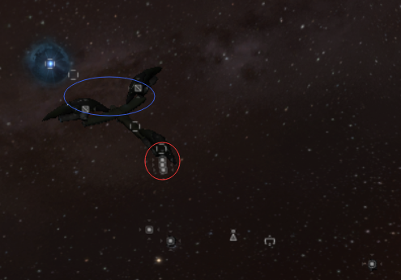
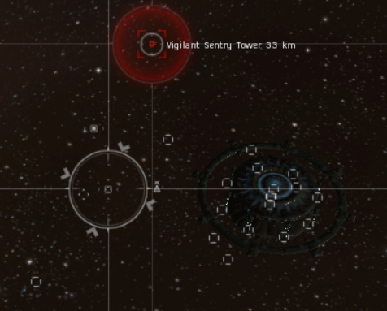

import EveType from "@/components/docs/eve/EveType.tsx";
import EveLocText from "@/components/docs/eve/EveLocText.tsx";
import UrlVideo from "@/components/docs/UrlVideo.astro";

<EveLocText locId={297403} /> 是一个 IV 级数据站点，收益在 60m-200m 之间，需要
95+（拢针）的扫描强度，
大部分为红色难度核心，除了物品箱子其他均需要数据分析仪，建议使用 T2 分析仪。
萌新扫描到该信号以后可以让群里大佬们来开，会分你一半的钱。标冬被人开过的应对方法请看章节末。

## 新手流程

流程视频：

<UrlVideo url="//player.bilibili.com/player.html?aid=31057239&bvid=BV1NW411Z7Cq&page=2" />

1. 破解 <EveType typeId={34315} />，进门扫一下 3 个箱子，除了最远处那个，有值钱的可以开掉，
   然后破解 <EveType typeId={34305} /> 把炮台移过来
2. 破解 3 个坐标箱子 <EveType typeId={34375} />，放到高能盒子 <EveType typeId={34374} /> 里面，激活轨道前往后部
3. 落地后，环绕并破解边上的 <EveType typeId={34305} />，成功后放无人机打掉远处的炮台，然后开箱子
4. 保存当前位置，跃迁出去再跳回来，回到物流区，破解远处的那个 <EveType typeId={34299} />，
   然后破解刷出来的警报单元 <EveLocText locId={297921} /> 
   破解成功：开掉那个完整的盒子，前往 <EveType typeId={34384} /> 区 
   破解失败：马上垂直向下开推子，至 120km 处离开毒雾范围。然后避开毒雾前往牵引光束边上的轨道，进入第二层，看第 6 步
5. 切向靠近牵引光束区的炮塔，并用无人机打掉，破解 <EveType typeId={34305} /> 并手动失败，直到触发警报。
   垂直向下开推子，至 80km 处离开毒雾范围。出现轨道后进入第二层
6. 到达第二层，靠近信标，直到看见 10km 外的 <EveType typeId={34305} />，破解。
   扫描刷出来的箱子，先破解最值钱的2个，然后去破解 <EveLocText locId={297936} />，成功破解后可以去破解另2个箱子

## 各区域介绍

:::caution
请对照流程仔细阅读！
:::

### 警报机制

**警报等级**：破解失败会提升一个警报等级。警报等级分 1-5 级，每一级都可能出现守护者，上升到第 5 级一定出现守护者。

<EveType typeId={11987} /> 不是怪，是一种范围伤害的毒雾。
出现前本地聊天框会有提示，一旦出现右图红字中的 30s
倒计时，请马上垂直向下打开推子离开。 毒雾出现时范围30km，30s 后扩散，扩散后范围
70km 左右，伤害 4x100/s 全伤，扩散后 4x250/s 全伤。 攻击建筑
<EveType typeId={30299} /> 会马上触发警报刷守护者。 任何情况刷毒雾后，在
<EveType typeId={34384} /> 位置都会出现前往第二层的轨道，
并且跃迁进入点会移动到靠近轨道的毒雾外部。

### 入口

<EveType typeId={34315} /> 
需要：<EveType typeId={30834} /> 
成功：出现轨道 
失败：2 分钟倒计时，结束之前没能成功破解，自毁（没有伤害）

### 第一层

分三个区域：物流区、牵引光束区、后部。

#### 物流区

红圈为 3 个坐标盒子 <EveType typeId={34375} />，
蓝圈为高低能量盒 <EveType typeId={34374} /> <EveType typeId={34373} />，
右下为最远处的 <EveType typeId={34299} />。

| 名称                          | 注解                         | 成功                                                                                                  | 失败                 |
| ----------------------------- | ---------------------------- | ----------------------------------------------------------------------------------------------------- | -------------------- |
| <EveType typeId={34299} />    | 图片右下角，推荐去二层前再开 | 刷出一个 <EveLocText locId={297921} />，必须 1 分钟内破解，不然刷守护者。开了这个后高低能轨道会失效。 | 无惩罚               |
| <EveLocText locId={297921} /> | 1 分钟时限                   | 出一个完整的箱子                                                                                      | 触发警报             |
| <EveType typeId={34299} />    |                              | 顺利打开                                                                                              | 无惩罚               |
| <EveType typeId={34300} />    |                              | 冬眠信号消失，离开站或是隐身 2 分钟后，这个坟会消失                                                   | 无惩罚               |
| <EveType typeId={34305} />    |                              | 将远处的一个炮台关闭并启动 <EveType typeId={34305} /> 旁的一个炮台                                    | 提升一个警报等级     |
| <EveType typeId={34375} />    | 坐标盒子，破解后不需要打开   | <EveType typeId={34381} /> <EveType typeId={34382} /> <EveType typeId={34383} />              | 可能提升一个警报等级 |
| <EveType typeId={34373} />    | 打开放入 3 个坐标            | 激活通向牵引光束的轨道                                                                                |                      |
| <EveType typeId={34374} />    | 打开放入 3 个坐标            | 激活通向后部的轨道                                                                                    | 推荐                 |

#### 后部

通过高能轨道来到后部，图中目前锁定的是要开的控制单元，远处是要打的炮台，右边上是隐藏箱子。

| 名称                                                                                     | 注解                                                                 | 成功                                           | 失败             |
| ---------------------------------------------------------------------------------------- | -------------------------------------------------------------------- | ---------------------------------------------- | ---------------- |
| <EveType typeId={34305} />                                                               | 落地后环绕，马上破解                                                 | 关闭左侧靠近的那个炮台，激活牵引光束区域的炮台 | 提升一个警报等级 |
| <EveType typeId={30460} /> <EveType typeId={30461} /> <EveType typeId={30462} /> | 基本打不中，关闭一个后，开推子切向靠近远的那个，环绕，并用无人机打掉 |                                                |                  |
| <EveType typeId={34386} />                                                               | 靠近后出现                                                           | 顺利打开                                       | 无惩罚           |

#### 牵引光束区

前往第二层的轨道会出现在 <EveType typeId={34384} /> 的边上

如果你是通过低能量轨道来的，会激活附近的一个炮塔

| 名称                       | 注解             | 成功                   | 失败             |
| -------------------------- | ---------------- | ---------------------- | ---------------- |
| <EveType typeId={34305} /> |                  | 关闭附近的那个炮台     | 提升一个警报等级 |
| <EveType typeId={30462} /> | 靠近会触发的炮塔 |                        |                  |
| <EveType typeId={34384} /> |                  | 把后部隐藏的箱子拉过来 | 无惩罚           |

### 第二层

这里的自毁和势力坟是一样的，不会造成伤害！

| 名称                          | 注解                | 成功                                                    | 失败                  |
| ----------------------------- | ------------------- | ------------------------------------------------------- | --------------------- |
| <EveType typeId={34305} />    | 靠近信标 \<2km 出现 | 刷出 4 个盒子，和 1 个自毁重置盒子，并 3 分钟自毁倒计时 | 无惩罚                |
| 4x 各种箱子                   |                     | 顺利打开                                                | 无惩罚                |
| <EveLocText locId={297936} /> | 自毁，没有伤害      | 自毁时间重置为 3 分钟                                   | 自毁时间重置为 1 分钟 |

## 中白/钢板小白强开流程

:::caution
该流程用了 bug，速度快，但是需要一定的有效。
:::

1. 进门扫一下先开最值钱的箱子，再开远处的 <EveType typeId={34299} />，然后开 <EveLocText locId={297921} />
   以及刷出来的 <EveType typeId={34385} />
2. 开 <EveType typeId={34305} />，并手动失败触发警报，躲开毒雾
3. 到中点，扛着炮台快速打开 <EveType typeId={34305} /> 然后进入第二层
4. 开完第二层后保存位置，跳出去再回来，去开牵引光束 <EveType typeId={34384} />，再开拉过来的箱子，
   炮塔不会打你（会打刚才开掉的那个防御单元）

流程视频：

<UrlVideo url="//player.bilibili.com/player.html?aid=31057239&bvid=BV1NW411Z7Cq&page=10" />

## 养标冬

不开 <EveType typeId={34300} />，<EveType typeId={34378} /> 和 <EveType typeId={34299} /> 的箱子信号不会消失，
DT 后用牵引拉过来的 6 个后部箱子会刷新，你就能多开 6 个箱子，同样第二层的箱子也会刷新。

## 标冬被人开过后怎么处理

跳进去后，看中点是否被毒云覆盖，如果有毒云，说明这个标冬开爆过了一个维护期，里面的毒云是没有伤害的，
可以按照正常的标冬程序开。如果没有毒云覆盖，说明这个标冬是当天开爆的，毒云不能进，
但是可以用上方的强开流程来，开掉后部的箱子然后去 2 层。近点的箱子就不要想了。
