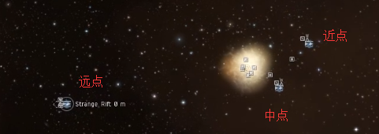
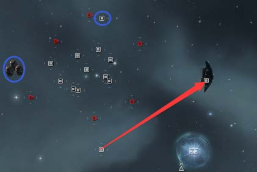
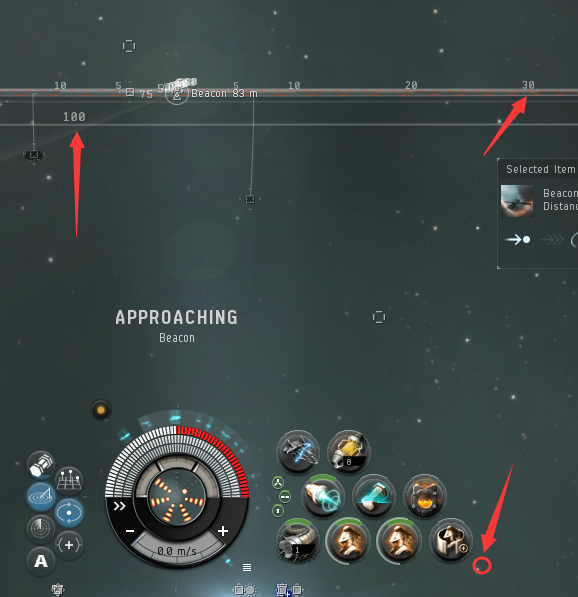
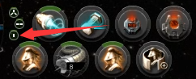
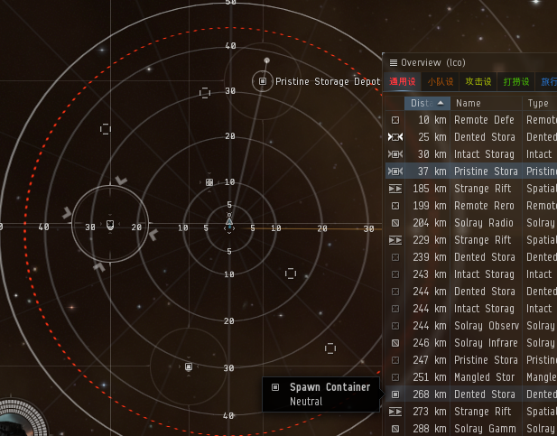
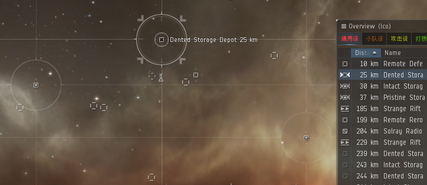
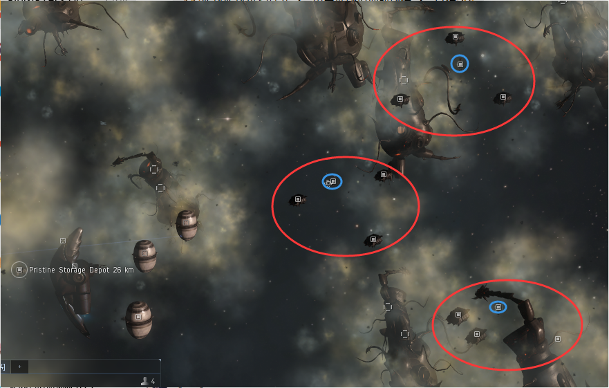

import EveType from "@/components/docs/eve/EveType.tsx";
import EveLocText from "@/components/docs/eve/EveLocText.tsx";
import UrlVideo from "@/components/docs/UrlVideo.astro";

<EveLocText locId={297744} /> 是一个 V 级数据站点，收益在 120m-300m 之间，需要
105+（拢针）的扫描强度，
几乎全部为红色难度核心，除了物品箱子其他均需要数据分析仪， 强烈建议使用
<EveType typeId={47028} /> + <EveType typeId={41534} />。
萌新扫描到该信号以后可以让群里大佬们来开，会分你一半的钱。

超冬可分为4部分，电离室风险较大。超冬被人开过的应对方法请看章节末。

## 新手流程

流程视频：

<UrlVideo url="//player.bilibili.com/player.html?aid=31057239&bvid=BV1NW411Z7Cq&cid=54293508&page=3" />

1. 破解 <EveType typeId={34315} />，无论落在哪个位置都回电厂近点开始
2. 破解中点的 <EveType typeId={34403} />，将获得的盘子放到对应名字的盒子里
3. 扫描气云中的盒子，开掉值钱的，去近点轨道前往炮塔层
4. 用保持距离，先破解左边的防御单元 <EveType typeId={34305} />（失败请马上离开），
   成功后马上开推子到右边破解维修单元 <EveType typeId={34438} />
5. 待所有炮塔都消失后，再过去开那 9 个盒子
6. （电离室有一个箱子可以无风险开）

**以下可选**

7. 回到电厂，放下 <EveType typeId={33474} />，把货舱东西以及姐妹会的发射器全部放入移动机库，
   换上爆抗 <EveType typeId={11646} />，别忘了带上甲修材料 <EveType typeId={28668} />，并保存位置
8. 前往远点破解修正单元 <EveType typeId={34406} />，回到中点前往地雷区，起跳之前启用爆抗
9. 地雷区攻略请见下文
10. 雷区破解完后跳出去，再跳回来，保存好刚才开出的东西后，前往炮塔层，
    破解超浪发射器，前往电离室，轨道如需要充能请见下文
11. 电离室攻略请见下文

## 各区域介绍

:::caution
请对照流程仔细阅读！
:::

### 入口

<EveType typeId={34315} /> 
需要：<EveType typeId={30834} /> 
成功：出现轨道 
失败：2 分钟倒计时，结束之前没能成功破解，自毁（没有伤害）

激活轨道可能会跃迁到以下3个位置，请激活边上的轨道，返回恒星能量发电厂近点处开始挖坟流程

1. 电厂近点
2. 电厂远点，激活边上的轨道回到近点
3. 炮塔层，激活边上的轨道回到电厂近点

### 恒星能量发电厂

电厂分为 3 个点，近中远点，箱子被黄色毒雾包围，伤害 600/s 纯电磁伤。

| 名称                       | 注解     | 成功                                                              | 失败   |
| -------------------------- | -------- | ----------------------------------------------------------------- | ------ |
| 近点                       |          |                                                                   |        |
| <EveType typeId={34391} /> | 盒子     | 对应放入 <EveType typeId={34400} />                               |        |
| <EveType typeId={23828} /> | 近点轨道 | 前往炮塔层                                                        |        |
| 中点                       |          |                                                                   |        |
| <EveType typeId={34300} /> | 箱子     | 冬眠信号消失，离开站或是隐身 2 分钟后，这个坟会消失               | 无惩罚 |
| <EveType typeId={34403} /> | 需要打开 | 获得任意一个盘子                                                  | 无惩罚 |
| <EveType typeId={34398} /> | 盒子     | 对应放入 <EveType typeId={34401} />                               |        |
| <EveType typeId={23828} /> | 中点轨道 | 前往远点 远点校准后：前往地雷区                               |        |
| 6x 箱子                    | 箱子     | 放入对应的盘子后毒雾伤害减低至 25/s，范围 13-17KM，破解失败无惩罚 |        |
| 远点                       |          |                                                                   |        |
| <EveType typeId={34399} /> | 盒子     | 对应放入 <EveType typeId={34402} />                               |        |
| <EveType typeId={34406} /> |          | 校准中点轨道 <EveType typeId={23828} />                           | 无惩罚 |
| <EveType typeId={23828} /> | 远点轨道 | 校对单元成功：回到中点 校对单元失败：到达炮塔层中心，触发炮塔 |        |

### 炮塔层

:::danger
在敌方的炮塔全部消失之前，不要过红线，也不要放无人机过线，防御单元一旦失败炮塔层就开废了。
:::

| 名称                       | 注解                         | 成功                                                                                      | 失败                                                          |
| -------------------------- | ---------------------------- | ----------------------------------------------------------------------------------------- | ------------------------------------------------------------- |
| <EveType typeId={23828} /> |                              | 回到电厂中点                                                                              |                                                               |
| 炮塔                       |                              | 不要超过防御单元与维修单元之间的红线就不会攻击你。单炮塔伤害 400-700，暴击会到 1500+      |                                                               |
| <EveType typeId={34305} /> | 这个开失败了炮塔层就只能放弃 | 离你最近的炮塔会变成友方帮你打其他炮塔,这个炮塔只能被维修单元修，不能被玩家修             | 本地显示45s倒计时，时间到后会刷16个炮台，无论是否再次破解成功 |
| <EveType typeId={34438} /> | 可以不破解                   | 为友方炮塔维修。                                                                          | 无惩罚                                                        |
| 9x 各种箱子                |                              | 顺利打开                                                                                  | 无惩罚                                                        |
| <EveType typeId={34303} /> |                              | 被攻击会爆炸，为轨道充能。100000 点爆炸伤害，爆炸后还会产生毒云，并在 60s 后刷炮台        |                                                               |
| <EveType typeId={34315} /> | 位于盒子中间                 | 1. 出现前往‘电离室’的轨道 2. 无法开启，轨道需要充能。 引爆那 3 个罐子为轨道充能。 | 无惩罚                                                        |
| <EveType typeId={34453} /> |                              | 为你提供 10s 的无敌，配合攻击引爆罐子，充能轨道                                           | 无惩罚                                                        |

备注：

1. 维修单元不是必须开的，不开的话，我方的炮塔炸后，敌方的炮塔依旧会逐渐掉血并炸掉。
2. 炮塔层有且仅在开了防御单元后，过线会触发**过线警报**，刷出 10 个炮塔，这个和普通警报是不同的。
3. 防御单元破解失败，主动攻击炮塔，炸了罐子，这 3 种情况会触发普通警报，这个警报是会刷出 16 个炮塔。
4. 炮塔层也可以使用那个空箱子 BUG，即使被开爆了，如果你能硬抗炮塔开掉一个箱子，
   跃迁出去再回来，你会发现所有炮塔都只会打那个箱子

#### 三层轨道充能

关于触发需要充能的条件

1. 电厂层放错了盘子。
2. 炮塔层维修单元失败，会触发需要充能，但是打完罐子并不会出现轨道。

<UrlVideo url="//player.bilibili.com/player.html?aid=31057239&bvid=BV1NW411Z7Cq&cid=54290881&page=9" />

先放出无人机，这边破解恢复单元 <EveType typeId={34453} />，点出核心别急着点掉，
让无人机去攻击罐子 <EveType typeId={34303} />，在飞到半路时点掉核心。
充能轨道后，这时你只有 60s 时间去重新破解超浪轨道 <EveType typeId={34315} />，成功与否 60s 后都会刷出 16 个炮台。
这个维护打开后会大幅减低罐子的伤害至 400 点左右，无法用来炸别人船。

### 地雷区

雷区如果你有 3w+ 的有效可以趟过去，但是需要 10W+ 有效才能抗住破解失败。

:::caution
在落地之前可能会吃到伤害。如果操作得当，可以无伤开。
:::

#### 地雷区机制

落地之后，靠近隐藏的防御单元，破解后会显示部分地雷，滚轮放大并移动视角才能看见显示的地雷，
存在隐藏的地雷，地雷的位置是固定的。同时也会显示部分盒子，雷区一共 3 个盒子，位置是固定的，
没有显示的盒子，手动驾驶飞船靠近 10km 内就会出现，位置请参考后图。

靠近地雷 10km 内会触发爆炸，单颗伤害分为 2000，3000，4500，5500，6000，7500 这几种，纯爆炸伤害，
一次触发会引爆 1-3 颗地雷，速度过快的情况下，会出现连续触发 2 次的情况（4 颗雷），
钢板小白保持 88%+ 的爆抗，一般不会被炸死。3 个箱子的位置如后图所示，以信标为原点，手动控制飞船就能把箱子撞出来。

| 名称                       | 注解        | 成功                              | 失败                  |
| -------------------------- | ----------- | --------------------------------- | --------------------- |
| <EveType typeId={34305} /> | 10km 内出现 | 显示 1-3 个盒子，显示部分地雷位置 | 引爆所有地雷 20-25 颗 |
| 3x 各种箱子                |             | 顺利打开                          | 无惩罚                |

#### 无伤雷区路线

流程视频：

<UrlVideo url="//player.bilibili.com/player.html?aid=31057239&bvid=BV1NW411Z7Cq&cid=72490091&page=8" />

:::note
该方法是基于 1080p 分辨率，及标准 UI 缩放，其他分辨率玩家请自行寻找合适位置。
:::

:::caution
注意：从信标处起跳，避免吃到地雷，撞出箱子**及时停船。**
:::

1. 落地后靠近信标，刷出防御单元后靠近并破解（非必须，失败必死）。
2. 撞 <EveType typeId={34300} /> 箱子，沿刻度线开 1 轮推子即可。
3. 撞 <EveType typeId={34385} /> 箱子，调整视角到 100KM 刻度线在最外围，
   双击低槽第四个位置的右下方为舰船方向，开 2 轮推子。
4. 撞 <EveType typeId={34378} /> 箱子，需要在信标处先垂直上升至 5700m-6100m，
   然后调整视角到 100KM 刻度线在最外围，双击右侧30KM刻度数字为舰船方向，开 2 轮推子。

注意 3 个箱子离信标的距离，一旦发现自己到了这个距离还没撞出箱子，请立刻停船原路返回信标处，再重新尝试。

#### 小白抗地雷方法

:::caution
技能不足的情况下 55% 爆抗只能超载 4 轮，如果装备双 64% 爆抗，不需要超载。
:::

:::note
全部使用保持距离。被雷炸到后马上停船维修好血量再前进。
:::

上双爆抗，低槽请按右图所示摆放，确保 4 次超载不会超坏其他装备，点击图示的小圆圈能直接将低槽全部预超载，
并在下一次循环开始超载。

**雷区俯视图**

**雷区侧视图**

### 电离室

电离室分布着很多残骸，残骸被毒云包裹靠近会造成伤害（全伤 4x100/s），可能会出现暴击 800 伤害，小白不要靠近，
直线前往 <EveLocText locId={298362} /> 不会碰到废墟毒云。

| 名称                          | 注解 | 成功                                                                                                       | 失败   |
| ----------------------------- | ---- | ---------------------------------------------------------------------------------------------------------- | ------ |
| <EveLocText locId={298362} /> |      | 大幅降低炮塔的命中率                                                                                       | 刷炮塔 |
| <EveType typeId={34447} />    |      | 顺利打开                                                                                                   | 刷炮塔 |
| <EveType typeId={34455} />    |      | 出现条件： 1. 破解失败 2. 激活 <EveType typeId={34449} /> 后 每个炮塔伤害在 700 左右，12s 一轮 |        |
| <EveType typeId={34449} />    |      | 放入3个 <EveType typeId={34450} /> 激活 建议先放入另两种物品各3份                                          |        |
| 10x 各种箱子                  |      | 顺利打开                                                                                                   | 无惩罚 |
| <EveType typeId={34453} />    |      | 顺利打开, 刷 90s 的恢复云，1s 修满                                                                         | 无惩罚 |

#### 电离室机制

在 <EveType typeId={34449} /> 激活之后，就会开始倒计时，90s 后第一波冲击到达，往后随着逗留时间越长，
冲击波出现时间越加频繁，每次冲击波持续 5s，除了第一波冲击波是本地提示出现 90s 后到达，
后续的冲击波时间间隔都不确定（前几波 20-40s），可能会出现多波冲击波（最多 3 波）同时到达的情况，
前 3 波大几率是单冲击波。激活 6m30s 后会出现 colossal shockwave 是普通冲击波 3 倍的伤害。

<EveLocText locId={298448} />

普通冲击波每秒造成 300\*2 的四个属性伤害，合计为 2400/s，5 秒共计 12000 的伤害。

激活后会逐渐刷出箱子，半分钟后 9 个箱子全部出现，激活同时也会出现恢复单元，
一共有 3 个恢复单元，第二个恢复单元大概在 2m20s 出现，第三个大概在 4m30s 出现，
单元破解成功后会提供 90s 的无敌，但是范围只有 5000m。

:::danger
目前资料显示只有区域①的恢复单元有效
:::

箱子的分布图示，每 3 个箱子（红圈）围绕 1 个恢复单元（篮圈），
还有一个个箱子刷在远处的废墟旁，有一定几率某个箱子会被炮台替换，一定几率会出现某个箱子被空箱子替换。

三个各区域风险介绍：

- ①区域无任何风险，靠近任何箱子都是安全的
- ②区域，最外侧的箱子和维护单元是安全的，内部 2 个箱子紧贴着废墟
- ③区域，最外侧发箱子是安全的，维护单元和内部 2 个箱子紧贴着废墟

另外，在 3 个区域外，远处废墟里的那个箱子距离废墟空间实体不到 500m

#### 电离室流程

:::caution
在电离室内使用推子请小心，务必提前停船，防止冲进废墟。
:::

**激活之前**

在进来后先去破解那个远处防御单元，破解成功后，先手动失败一个罐子刷出炮塔，
环绕罐子炮塔是打不中小白的，再成功破解那个箱子，这时会刷一个完整箱子，可以去开掉。
然后跳出去再回来（注意：如果你在炮塔层充能了，那么炮塔层会刷出炮塔，不能再进入），
你会发现炮塔全部在打刚才破解的防御单元（和之前标冬是同一个BUG）。

一共丢 3 个液体到端脑内就能够将其完全激活，建议先丢 3 个齿轮再丢 3 个纳米，
能大概率不刷新的炮塔和空箱子，不是每次都有足额的另外两种材料，可以提前备好。

在激活之前，把保持距离设置为 2200m，环绕半径设置为 1000m，关闭推子的自动循环。

**激活之后**

:::caution
确保你在激活之前，把身上所有值钱的东西都保存到移动机库中。
如果本地出现 15s 倒计时，没时间去开维护，请果断离开。
:::

1. 只开 2-3 个最值钱的（风险系数中）：
   在激活之后，开一轮推子靠近区域①的箱子，保持距离即可（如果新刷了炮塔，请环绕），
   同时扫描区域①的箱子，并开掉最值钱的那个，然后破解维护单元，不急着点掉核心，
   此时扫描剩下的箱子标记 2 个值钱的，本地出现冲击波提示后点掉核心，
   等待冲击波结束后马上靠近标记的盒子开掉，注意本地的冲击波提示，开掉后返回区域①的维护单元，
   待第二波冲击波过去后，再去开另一个盒子。

   <UrlVideo url="//player.bilibili.com/player.html?aid=31057239&bvid=BV1NW411Z7Cq&cid=70979977&page=11" />

   **抗冲击波开**

   使用双钢板小白/钢板中白（有效超过 12060 即可硬吃一波冲击波），小白上 2 个 T2 三角插，修换成钢板。
   以下操作均基于前 3 波冲击波为单冲击波，一旦出现双冲击波请躲在维护云中或是马上离开。

2. 最大化开箱（风险系数大）：
   在激活之后，马上开推子靠近最近的维护单元，保持距离即可（如果之前没处理掉炮塔，环绕维护单元 1000m），
   同时扫描单元边上的 3 个箱子，确定最值钱的。开完那个箱子后，马上锁定区域②的箱子并确定最值钱的，
   先开推靠近那个安全箱子，等速度降下来后再靠近目标箱子并保持距离，这里会需要硬吃第一波冲击波。
   开完这个箱子后马上回区域①的维护单元并开掉，如果在维护开掉之前本地出现新的冲击波倒计时请马上离开。
   在维护云里面扫描区域③的箱子并确定值钱的 2 个，如果区域①的箱子还有值钱的可以在此时开掉。
   算好时间等第二波冲击波过去后，马上开推靠近区域③的维护单元并保持距离，先破解目标的 2 个箱子后，再去拾取物品，
   如果是两个内侧的箱子，在捡完一个箱子后必须先返回区域③的外侧箱子然后再去另一个，必须绕一下不然会吃到废墟的伤害。
   同时注意本地的冲击波提示，抗完第三波冲击波就要离开了。一共可以开区域① 2 个，区域② 1 个，区域③ 2 个，共计 5 个。

3. 小白全开：
   激活后先开推靠近区域①边上的废墟，距离 13KM 时停船减速，靠近并破解区域①的第一个箱子，
   然后靠近（不是保持距离）区域②的安全箱子，破解后再去破解上方的内侧箱子并保持距离。
   注意你和箱子的距离稳定后再打开箱子，不然超过 2500m 打开箱子，系统会自动给出靠近的指令，导致冲入废墟。
   这里硬抗第一波冲击波。手速快且第一个冲击波还没来你可以把下方另一个内侧箱子也直接开掉，直接使用保持距离，
   然后马上回到区域①的维护单元并开掉，然后马上开推靠近区域③的安全箱子开掉，之后保持距离并破解右侧箱子，
   中间需要硬吃第二波冲击波。到这里为止，经验手速到位了都是可以稳开，共 1+3+2=6 个，剩下的 3 个就要看运气了。

   如果此时维修云已经结束，注意第三波冲击波的同时，去开区域③最后那个箱子。
   如果你的开箱速度够快，快速回到区域①的维修云修满血，开掉区域①最后那个箱子
   （维护需要坚持到第三个冲击波）然后靠近区域③最后那个箱子保持距离，如果运气好第四波是单冲击波，
   你就能完成小白挖穿超冬的奇迹！

   从激活到第五个冲击波提示一般时间在 250s - 300s，你要开掉共计 10 个箱子。

4. 金鹏全开：

   有效抗视频：
   <UrlVideo url="//player.bilibili.com/player.html?aid=31057239&bvid=BV1NW411Z7Cq&cid=56550854&page=12" />
   
   - 有效抗：核心思路是在 6 分 30 秒的大冲击波来之前挖光，而在此之前的冲击波总数基本不会超过 8 个，
     所以将船只的有效堆到 10W 以上，就能硬抗大冲击波之前的所有冲击波。
   - 普通装：皮中 A，皮 C 全抗，皮 X 电抗，大盾扩，可以抗下冲击波，在下一波来之前修好，
     出现多冲击波适度超载修盾，在大冲波来之前离开。

## 最效率流程

1. - 远点：破解防御单元，激活轨道，到近点，激活轨道
   - 近点：激活轨道
   - 炮塔层：不动
2. 炮塔层，放下移动机库保存位置，开防御和维护单元，然后走轨道回到电厂中点
3. 破解观测单元，拿盘子，扫描气云中的箱子并标记
4. - 盒子在边上，放好盘子，并开掉气云里面的箱子
   - 盒子在远点，盒子在近点，继续按流程
5. 激活中点轨道（远点放盘子），并破解防御单元，然后激活轨道回到近点（近点放盘子）
6. 激活轨道去炮塔层，换上双爆抗，然后开箱，之后激活轨道回到中点（开气云里面的箱子 ），前往雷区
7. 开完雷区，跳出去后回来，到炮塔层换装，前往 3 层电离室，触发炮塔，并开掉那个完整箱子
8. 3 层开完后，跳出去，再跳回来回收移动机库

## 超冬被人开过后怎么处理

请不要盲目进入轨道可能被秒，前往[这里](https://zkillboard.com/)查询你所在的星系，
看这3天有没有人被炮塔击毁，如果有显然是炮塔层被开爆了，看情况二。
极小可能有人开爆炮塔层后幸存，最保险的方法就是在维护以后再进入。

1. 电厂被人开错了：  
   萌新可能会搞错对应盘子的位置，检查一下放盘子的盒子，如果名字为 <EveLocText locId={298073} />
   那么就是盘子被放错了，小白只能放弃，或者用中白顶着毒云开。
2. 炮塔层被人开爆了：  
   看门口的超浪发生器是不是满的，如果满的说明已经过了一个维护周期，炮塔层的警戒炮塔会隐藏。
   注意，你一旦进入就会触发警报 3-5s 刷出炮塔，但是你可以马上激活身边的轨道回到电厂，
   开那儿的箱子（如果上个人还没开掉的话）。
   或者再次破解超浪，刷一个到电厂的轨道。
   如果超浪是空的，那么就不要进去了，22 个秒锁炮塔在等着你，总之炮塔层肯定是开不了的。
   （8500+ 有效的小白，一般不会被秒，冒险可以尝试进入，落地起跳回电厂）
