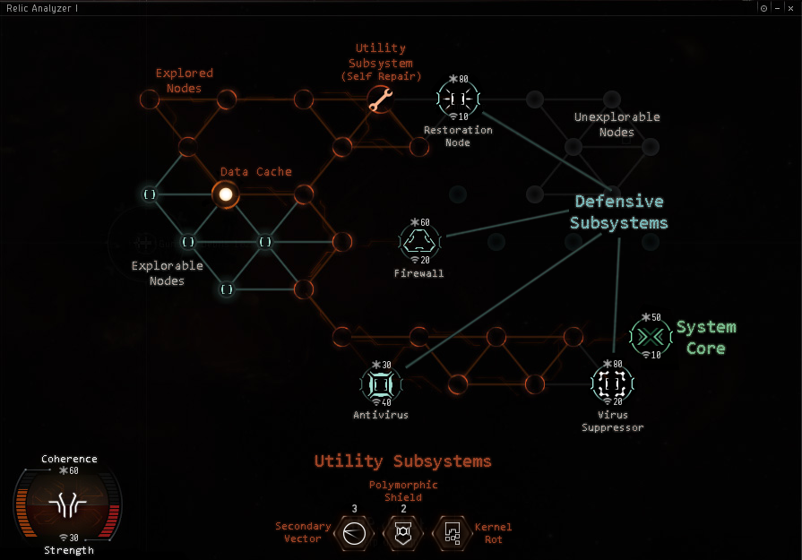
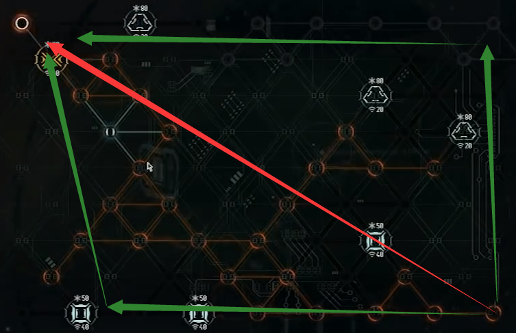
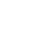

import EveLocText from "@/components/docs/eve/EveLocText.tsx";
import EveType from "@/components/docs/eve/EveType.tsx";
import TopAlignedTable from "@/components/docs/TopAlignedTable.astro";

## 破译机制

上图是一个破解小游戏的图解，<EveLocText locId={500299} />是你的血量，

<EveLocText locId={500298} />
是你的攻击， 基于[快速指南/前期](../quick-guide#前期)的建议配置， 你目前应该有
70 血量 25 攻击，除了最高难度的红核心，其他难度的破解应该都比较容易。

每走一步会出现 1-5 这样的数字，表示离最近的无害点的距离（工具、隐藏节点、核心）的步数。
超过五步也显示 5。
如果点到一个角落出现数字 5 那就不用点了，附近没有有益节点。
在攻击力较低的时候推荐沿墙边走，虽然比较慢，但是不会被封死，
攻击高了以后尽量走六边形正中间那个点，能快速发现周围的可用节点。

> :::tip
> 系统核心出现在对角的可能性非常大，所以推荐两种走法：
>
> 第一种红线直接杀对角，需要比较高的攻击，在你确定破解难度后可以马上使用这种策略。
>
> 第二种绿线，沿边缘走如果出现防御节点可以从另一个方向继续开始，
> 适合没有时间限制的普通坟，而且还有个优点是能发现核心在近端两个对角的情况。
>
> 
>
> 碰到防御节点不需要马上点掉，请换一个方向继续，除非是回血节点。
> 拿到加血道具尽快使用，其他道具妥善保留按下方图解说明使用。

破解的时候不要紧张，更不要手快，因为这个小游戏存在延迟，
当你点出核心后可能手快点到后面出了一个防御节点把核心封死。
发现自己的血量不够杀死核心时，别忘了多开其他的点，可能出道具。
提升破解成功率的最好途径就是提高攻击力，使用T2分析仪
（<EveType typeId={30834} />、<EveType typeId={30832} />、<EveType typeId={41534} />）
加上 <EveType typeId={47028} /> 能到 60 攻，
基本一下一个节点，所以请尽快挂出。

## 节点类型

<TopAlignedTable>

| 名称               | 图标                                                                   | 作用                                                                                                                               |
| ------------------ | ---------------------------------------------------------------------- | ---------------------------------------------------------------------------------------------------------------------------------- |
| Data Cache         |                    | 一个隐藏节点，可能会出现道具也可能会出现防御节点，无路可走后再点开                                                                 |
| **道具**           |                                                                        |                                                                                                                                    |
| Self Repair        |                  | 使用后，接下来的3步，随机恢复4-10点同步值, Coherence是没有上限的，所以尽快使用                                                     |
| Kernel Rot         |                    | 使用后目标血量减半                                                                                                                 |
| Polymorphic Shield |    | 抵御两次伤害，如果你先杀死目标，这个效果会保留                                                                                     |
| Secondary Vector   |        | 每回合造成20点伤害，持续3回合，使用时不算做攻击，点其他位置也能造成伤害。使用时点一下工具，再点一下病毒，然后点其他任意地方两次。  |
| **防御节点**       |                                                                        |                                                                                                                                    |
| Firewall           |                | 普通防御节点                                                                                                                       |
| Antivirus          |              | 高攻节点，请配合Polymorphic Shield点掉                                                                                             |
| Restoration Node   |          | 每回合会随机增加一个节点20血量（捡工具也算），不会恢复自己和系统核心，一旦出现马上点掉                                             |
| Virus Suppressor   |  | 降低攻击力15点，会叠加，直到剩10点。如果你起始只有25攻70血，意味着你点出后，很可能杀不掉它，所以请留好Secondary Vector和Kernel Rot |
| System Core        |                              | 你的目标，系统核心的颜色表明破解难度，  难度影响部分节点的血量和攻击。  绿：非常简单/简单 橙：中等 红：困难                |

</TopAlignedTable>
