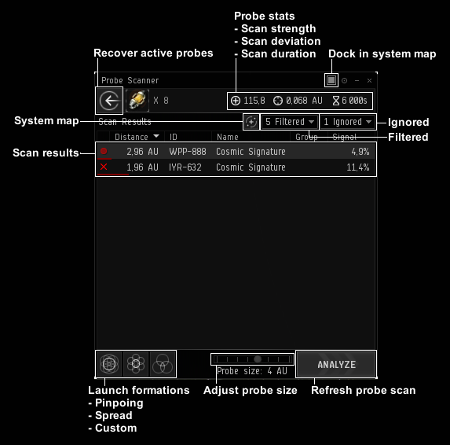

import EveLocText from "@/components/docs/eve/EveLocText.tsx";

## 界面布置

1. 按 <kbd>Alt + P</kbd> 你能打开上图窗口，
2. 点击右上角 <EveLocText locId={524661} />，将这个窗口固定在界面上，
3. 在 <EveLocText locId={263697} /> 里面勾上 <EveLocText locId={142426} />，
4. 熟悉界面上的图标及按钮，完成布置。

## 扫描操作

扫描的基本操作游戏新手教程有教，如下是一些有用的技巧：

- 使用第一种扫描模式，<EveLocText locId={500191} />；
- 单击星图内红点，或者单击扫描界面的该信号，能够锁定视角；
- 在星图里双击能呈现水平视角，再次双击呈现垂直视角，非常方便锁定位置；
- 第一针用 8AU，如果你的探针强度超过 80，且信号已经分析 20% 左右，第二针可以直接拉到 2AU。
  新手的话 8AU 下针，逐步缩减 4AU、2AU、1AU、0.25AU；
- 当信号呈现，球状和圆盘状时，请将你的扫描区域（最内部，仅仅是外部是不够的）全部包裹住它；
- 信号呈现两点时，看你上一针涨了多少，如果很多说明就是离你目前扫描位置近的点，
  如果不是就是远点（90% 情况为远点）；
- 遇到信号即使把圈缩小到 0.25AU 还是扫描不出来，按住 <kbd>Ctrl</kbd>+滚轮拢针，
  拖动箭头缩小8个探针直至几乎重叠成一球形（但不能完全重叠），
  还是不行就把信号编号、星系发到频道和群里，会有大佬帮忙开；
- 建立一个舰队，就能使用数字键直接标记箱子，极大提高效率；
- 扫描度到 25% 就能看出信号名称和等级，
  如 <EveLocText locId={500108} /> <EveLocText locId={500107} />
    <EveLocText locId={500106} /> <EveLocText locId={500105} />， 扫描到 75%
    才能看出扫描信号的名字，到 100% 就可以跃迁；
- <EveLocText locId={78660} /> 中 <EveLocText locId={78662} />
  至少设置为 Medium（中）才可正常显示气云体积，potato
  mode（土豆模式）下无法显示气云体积，
  是透明不可见的，挖冬眠者坟时这点尤其要注意。
