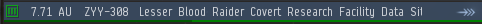
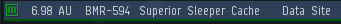

import EveType from "@/components/docs/eve/EveType.tsx";
import EveLocText from "@/components/docs/eve/EveLocText.tsx";

{/*
本部分使用 <table> 而非 Markdown 语法的表格是为了更好地兼容 MDX。
同时，由于表格中存在图片且文字长度差距显著，使用 Markdown 表格会极为混乱。
*/}

<table style={{ overflow: "unset" }}>

<thead>
    <tr>
        <th>信号类型</th>
        <th>名称</th>
        <th>简介</th>
    </tr>
</thead>

<tbody>

<tr>
    <td>
        <EveLocText locId={500108} />
    </td>
    <td>
        各种各样 
        战斗气云
    </td>
    <td>普通异常、死亡或空代任务</td>
</tr>

<tr>
    <td>虫洞地点</td>
    <td>
        
        <EveLocText locId={70930} />
    </td>
    <td>通往虫洞空间或其他地区</td>
</tr>

<tr>
<td><EveLocText locId={500107} /></td>
<td>

类似如下命名形式的为普通可采集气云信号

- <EveLocText locId={110644} />
- <EveLocText locId={111382} />
  （以下为洞气，有机制怪）
- <EveLocText locId={111385} />
- <EveLocText locId={111387} />

类似如下命名形式的为特殊气云考古点

- <EveLocText locId={111372} />
- <EveLocText locId={111814} />
- <EveLocText locId={111951} />
  （以上为低安独占）
- <EveLocText locId={111367} />
  （00独占）

类似如下命名形式的为战斗气云，类似于死亡空间

- <EveLocText locId={111883} />
- <EveLocText locId={111879} />

</td>
<td>多为气云采集点，部分地区存在拉怪可挖的坟点，具体内容参考进阶教程。</td>
</tr>

<tr>
<td>势力坟（数据，遗迹）</td>
<td>

数据：

- <EveLocText locId={125892} />
- <EveLocText locId={111162} />
- <EveLocText locId={111820} />

遗迹：

- <EveLocText locId={111181} />
- <EveLocText locId={111193} />
- <EveLocText locId={111949} />
</td>
<td>
**新人主挖这种坟。** 
无怪，分布于各安等与1、2、3级虫洞，
产出：
- 打捞件（<EveType typeId={25622} />）、
- 解码器（<EveType typeId={34201} />）、
- 数据核心（<EveType typeId={20411} />）、
- 蓝图拷贝（<EveType typeId={4384} />）、
- 各种组件（<EveType typeId={21074} />）、
- 以及其他杂项。
</td>
</tr>

<tr>
    <td>幽灵坟（数据）</td>
    <td>
         -{" "}
        <EveLocText locId={292079} />
        - <EveLocText locId={292084} />
        - <EveLocText locId={292089} />
        - <EveLocText locId={292094} />
        （虫洞独占）
    </td>
    <td>
        开箱失败就会爆炸,造成大量伤害，有隐藏计时器（小于2分钟），到时间会刷怪。
         
        请看进阶。
    </td>
</tr>

<tr>
    <td>冬眠者储藏站（数据）</td>
    <td>
         -{" "}
        <EveLocText locId={296755} />
        - <EveLocText locId={297403} />
        - <EveLocText locId={297744} />
    </td>
    <td>有难度，收益高，解法请看进阶教程。</td>
</tr>

<tr>
    <td>普通冬眠坟（数据、遗迹）</td>
    <td>
        - <EveLocText locId={111644} />
        （遗迹） - <EveLocText locId={111659} />
        （数据）
    </td>
    <td>
        虫洞独占，有怪，无炮塔可以拉怪挖，产出 T3 黄图{" "}
        <EveType typeId={34412} />
        ，不建议挖。
    </td>
</tr>

<tr>
    <td>无人机坟（数据）</td>
    <td>
        - <EveLocText locId={111800} />
    </td>
    <td>
        出产无人机组件（
        <EveType typeId={28363} />） 和加强无人机蓝图（
        <EveType typeId={28277} />
        ）， 有几率触发无人机坟远征。
    </td>
</tr>

<tr>
    <td>
        <EveLocText locId={297962} />
    </td>
    <td>
        - <EveLocText locId={297962} />
    </td>
    <td>
        只会出现在破碎虫洞（J0开头的虫洞）。
         
        与超冬相同等级和扫描强度。
         
        非常稀有，产出大量黄图。
         
    </td>
</tr>

</tbody>

</table>
