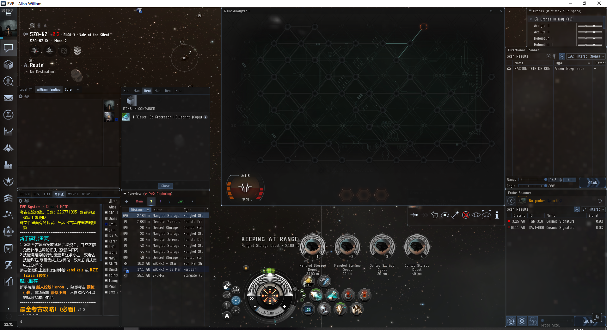
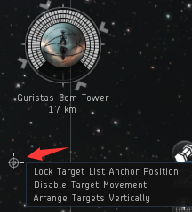
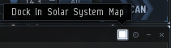
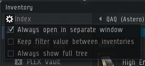
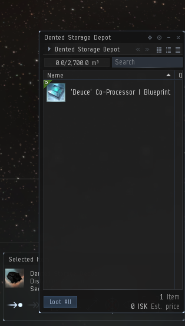

import EveLocText from "@/components/docs/eve/EveLocText.tsx";

## 通用界面布置

上图是我推荐的标准挖坟界面布置图，基于1080p分辨率显示器，如果是768p分辨率可以把左侧的聊天框去掉，并把仪表盘移走。所有的窗口设置完成后，再次打开还会保存在固定的位置。

要点
1. 把锁定目标栏移动到下方的仪表盘上部，找到右图所示的圆点，即可拖动调整位置
   
   
   
2. 把舰扫和探针扫描窗口拿出来，找到右图这个正方形，点击后就会把这个窗口放在主界面上，然后点击边上的pin按钮，将其固定。
   
   
   
3. 把物品选择栏移动到一个位置，使那一排的按钮正好位于锁定栏的上方，破解界面的下方，看前图，方便破解后快速开箱捡取物品。

## 快速捡取箱子设置

先打开背包，点击左上的小齿轮，勾选右图的这个选项，这样每次点开箱子不会自动打开背包。

然后把打开的箱子的界面调整位置到右图所示，并把 <EveLocText locId={263155} /> 的按钮覆盖在，
物品选择栏的 <EveLocText locId={61566} /> 按钮上，这样就能做到开箱秒拿物品，而且拿完后这个窗口会自动关闭。

