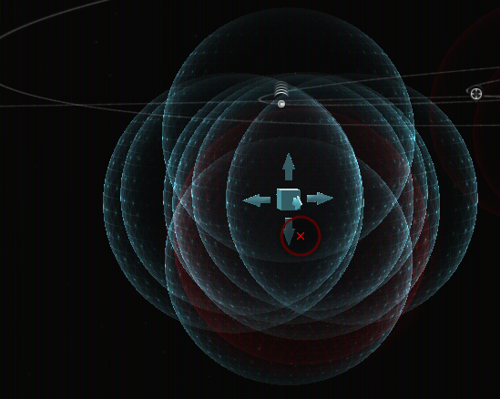

import EveType from "@/components/docs/eve/EveType.tsx";
import EveLocText from "@/components/docs/eve/EveLocText.tsx";

## 一针判定信号

以 120 强度为例， 用 8au 针，扫完之后看信号强度。

- 信号强度在 8.6+，一般为 II 级及以下信号
- 信号强度在 5-8.5，一般为 III 级信号
- 信号强度在 3-5，一般为 IV 级信号
- 信号强度在 2% 以下，为冬眠者储藏站信号

如果碰上两点，则 x2 计算，碰上圆圈 x4，碰上球形，看强度 1% 以下就重新扫描定位一下。

我们常见的信号

- III 级信号为[隐秘研究设施](../../advance/ghost)、[气云](../../advance/gas)
- IV 级信号为 2 个冬眠者储藏站、1 个气云（低安无炮台，00有毁电），
  还有普通势力小船坞（e.g. <EveLocText locId={111891} />）跟普通势力遗迹（e.g. <EveLocText locId={111152} />）
- V 级信号只有[超冬](../../advance/superior-sleeper)以及虫洞里的 <EveLocText locId={297962} />。

在欧服玩考古到专精，一般只扫这 3 种信号，对于 I、II 级信号就完全不用管，
以后到一地方只需要扔 8AU 针， 8.6 以上的全部右键清除当前结果，扫剩下的信号。
而在我们高安赶路时，也可以在星门跳星门时扔一次 8AU 的针，看看有没有隐秘或超冬，用这种方法找超冬非常效率。

## 不用针判定信号

- 冬眠者储藏站一般在行星 6AU 外
- 隐秘研究设施一般在行星 5AU 左右
- 普通气云遗迹数据信号都在行星 4AU 内

所以一般来说，超高级的信号圆圈范围越大，而且这个圆圈经常不会包围行星。
如果找多了你就能进星系一眼看出一个信号会是超冬。还有一种深空虫洞，经常离行星 6AU 外。
像下面这样一个 8AU 圈都杠不住 ,而且没包围行星，多半是超冬。

以后如果碰上扫死亡的定位 IV 级信号，不能确定名字，叫他跳最近行星，看下距离，
如果在 4AU 内，就是小船坞 <EveLocText locId={111891} />，如果是 5AU 外，一般是冬眠。
