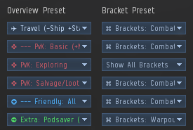

import EveLocText from "@/components/docs/eve/EveLocText.tsx";

普通挖坟直接使用频道置顶的总览，或者你自己公司提供的总览即可。

如何设置总览请自行百度。

总览需要设置 2 种，一是主界面中的总览栏，二是 <EveLocText locId={503992} />。

挖坟总览，推荐只显示可停泊建筑，星门，太阳，玩家飞船以及普通箱子，冬眠箱子和炮塔。

然后再设置 brackets，日常我推荐用显示全部。

可选：小白挖穿超冬3层的时候为了提高锁定效率可以特别做一个专门的设置（置顶已经包含），
只显示冬眠箱子和炮塔，然后直接 <kbd>Ctrl</kbd>+鼠标框选所有箱子，记得在起跳 3 层之前切换至这个配置。

所用到的分类列表：
- 普通坟的箱子：<EveLocText locId={287802} />
- 冬眠坟的箱子：<EveLocText locId={63773} />
- 冬眠坟中的空间实体以及信标：<EveLocText locId={63735} />
- 冬眠坟中的炮塔：<EveLocText locId={63841} />
- 冬眠坟中可以放东西的箱子：<EveLocText locId={64301} />
