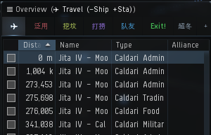
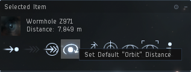
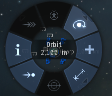
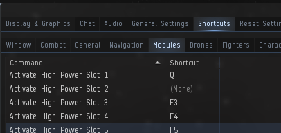
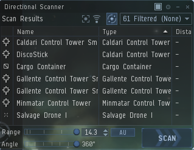

1. 调整总览，加入 `南北派专家组` 后你会在对话框看到这个消息，点击 `南北派总览`，就能够自动载入。下图为总览。

2. 调整环绕距离为 2100m，随便点击一个物体，在环绕按钮上右键，即可调整默认环绕距离，注意这个默认距离只能在，下图图示上使用，右键环绕并没有这个选项

3. 设置快捷键，点击左上角 ，打开设置，快捷键设置，调整常用的模块到顺手的按键，例如隐身 推子 探针扫描 D扫描，关键时刻可能救你一命

4. 设置 D-扫描，<kbd>Alt+D</kbd> 打开 D-扫描界面，并将其固定在外部，调整角度为 360°，注意 D-扫描的过滤选项是依据你的总览设置，也可独立设置

