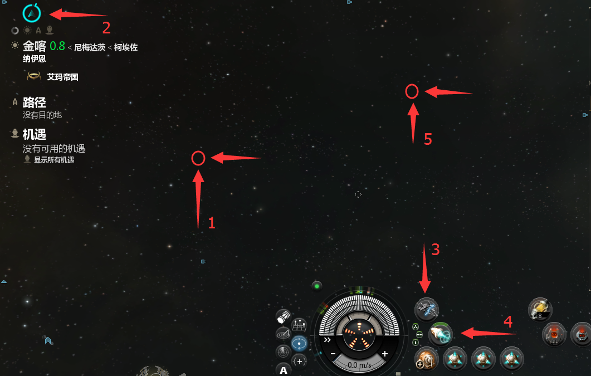
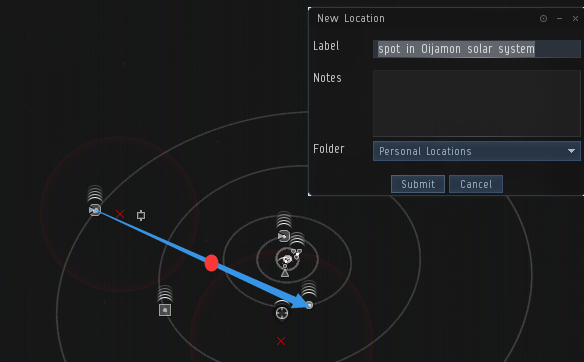
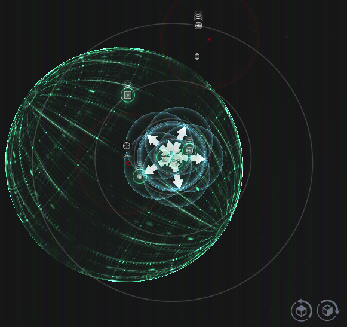

## 假隐跳

过门后，对太空随意一个方向双击，如箭头1。注意屏幕右上角的隐形图标，留意其是否消失，参考图中的箭头2。隐形图标消失，立刻点开隐形装置，如箭头3。点开隐形装置后，迅速激活微型跃迁推进器。完成以上操作后，再对太空随意一个方向双击。
（跃迁动作判定为当前船速的 70% 即可达到跃迁状态，凭速度感觉跃迁时机）

进阶

1. 隐跳操作有三种。第一种隐跳操作为“基础”中讲述的操作。
2. 第二种操作，与第一种操作相近，不同之处在于先激活微型跃迁推进器再点开隐形装置。
3. 第三种操作，先朝向一个卫星，然后激活微型跃迁推进器，再点开隐形装置。等待微型跃迁推进器接近循环过3/4，关闭隐形，跃迁到目标卫星 0m。
4. 隐形装置要正常运作需要保证舰船 2 公里范围内没有其他物体。如果2公里范围内有其他物体，不仅无法激活隐形，即使已经处于隐形状态，也会因此退出隐形。
5. 第一种操作和第二种操作适用于在 0.0 被堵门的情况如场景1。网络状态不好，选择第一种操作。网络状态良好，选择第二种操作。第三种操作适用于没有机动跃迁扰断器和拦截探针的情况如场景 2。
6. 在场景1,成功实施假隐跳操作后，在敌对不离场的情况下不建议显形。要离开，可以先缓慢飞出跃迁干扰范围，并至少距离敌对舰船 45 公里以上，再提前朝向好，最后，显形跃迁离场。

## D-扫描的使用

点击D-扫描面板上的图标。

能够显示当前 D-扫描的范围，按默认快捷键 D 能够进行扫描，显示该区域内所有非隐身目标，调整角度缩小扫描范围，多次尝试能获得敌人大概方位。

## 安全点/深空点

随意选择一个星球跃迁，在跃迁途中按Ctrl+B保存位置，上图的红点位置，注意 保存的位置是当你点击了submit时自身的位置，所以请留有一定的提前时间。

按照以上方法设置的安全点大部分会靠近星系中心，还是有很大可能性在敌人的D-扫描范围内，这时我们需要学会设置深空点，当你扫描完某些数据遗迹点或是虫洞，发现它们位于地图外侧，那么这就是一个非常好的深空点，记得保存下来，后期你常去的地图都应该有一个深空点。

还有就是过门安全点，专用于星门在14AU以外的星系，这时候如果你要过门，如果有轻拦堵，你是五度不到的，所以提前在这类星门附近做个150km以外的安全点很有必要。
